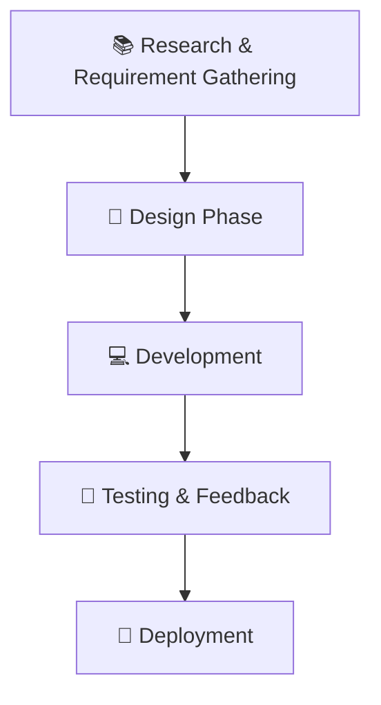

<!-- ✨ Animated Header Banner -->

  

---

<h1 align="center">🌀 <b>AnantaKolam</b></h1>
<h3 align="center">Preserving Heritage Through AI + AR</h3>

---

## 🎯 **Overview**  
**AnantaKolam** is a digital innovation by **Team Pixel** for **Smart India Hackathon 2025 (Problem ID: SIH25107)** under the *Heritage and Culture* theme.  
It blends **Artificial Intelligence (AI)** and **Augmented Reality (AR)** to **understand, recreate, and preserve Kolam designs** — a traditional South Indian floor art — making them accessible, interactive, and future-ready.

> 🚧 **Project Status:** In Progress  
> 💖 **Demo Link:** [Lovable Link – Coming Soon](https://kolam-weave-studio.lovable.app/)  

---

## 🧩 **Problem Statement**  
Traditional **Kolam art** is fading due to modernization, limited markets, and lack of digital documentation.  
Young generations are disconnected from this heritage, threatening its survival.  

---

## 🌸 **Our Vision**  
To digitally **revive, teach, and preserve Kolam art** through AI-driven understanding, AR-based interaction, and community-powered learning — ensuring culture meets technology.

---

## ⚙️ **Solution Highlights**
| Feature | Description |
|----------|--------------|
| 🎨 **Kolam2Vector Engine** | Converts Kolam sketches into scalable vector graphics. |
| 🤖 **Self-Training AI** | Learns from users’ Kolam patterns to improve accuracy. |
| 🧓 **Virtual Grandma Mentor** | AI tutor that guides learners and narrates cultural stories. |
| 🧠 **Cultural DNA Archive** | Digitally stores authentic Kolam designs and metadata. |
| 💰 **Marketplace Integration** | Enables artists to monetize their Kolam art globally. |
| 📱 **AR Learning Mode** | Lets users draw and visualize Kolams interactively. |

---

## 🧰 **Tech Stack**

  

| Layer | Technologies |
|-------|---------------|
| **Frontend** | React.js, SVG.js, WebAR.js |
| **Backend** | Python, TensorFlow.js |
| **Database** | Firebase Firestore & Firebase Storage |
| **Deployment** | Vercel, Heroku |
| **AI/ML** | OpenCV, TensorFlow |
| **CI/CD** | GitHub Actions |

---

## 🔬 **Development Process**

---

## 🌍 **Impact & Benefits**

| Domain | Impact |
|---------|---------|
| 🪶 **Cultural** | Preserves Kolam art and promotes cultural appreciation. |
| 🧑‍🏫 **Educational** | Provides an interactive AR-based learning experience. |
| 💼 **Economic** | Opens new digital market opportunities for artisans. |
| 🌱 **Environmental** | Reduces chalk wastage by digitalizing Kolam creation. |
| 🤝 **Social** | Builds global community engagement around heritage art. |

---

## 🧭 **Feasibility & Sustainability**
- 🌐 Mobile-first, low-data design.  
- 🧩 Hybrid approach (Offline + Online events).  
- 🤝 Collaboration with NGOs and cultural organizations.  
- 🔐 Ensures IP protection and ethical use of digital art.  
- 🌱 Continuous user engagement via seasonal AR challenges.

---

## 📚 **Research & References**
- 📄 [Anika Sarin – Research Paper](https://drive.google.com/file/d/1MwjoJgupxs7nRJ20YqQK1rO9pb17N9wn/view)  
- 📄 [Sasithradevi et al. – Research Paper](https://drive.google.com/file/d/1iTV5vshcaNwVAb1qISQSY_eJg_ZG-4Fx/view?usp=drivesdk)  
- 💻 [GitHub Repository](https://github.com/RaGaS958/AnantaKolam.git)  
- 🎥 [Project Video Explanation](https://youtu.be/IXFcG02vOgw)

---

## 👥 **Team Pixel**

| Role | Member |
|------|---------|
| Team Lead | *TBD* |
| Developers | *TBD* |
| AI/AR Engineers | *TBD* |
| Designers | *TBD* |

(*Names will be updated as the project progresses.*)

---

## 🚀 **Current Status**
- 🔧 **Stage:** Prototype Development  
- 🌈 **Next Steps:**
  - Integrate real-time AR module with Firebase  
  - Train AI models for better pattern generalization  
  - Launch live demo and open-source community  

---

  
 <h3 align="center">“Bridging tradition and technology — one Kolam at a time.”</h3> 
— <b>Team Pixel | Smart India Hackathon 2025</b>

